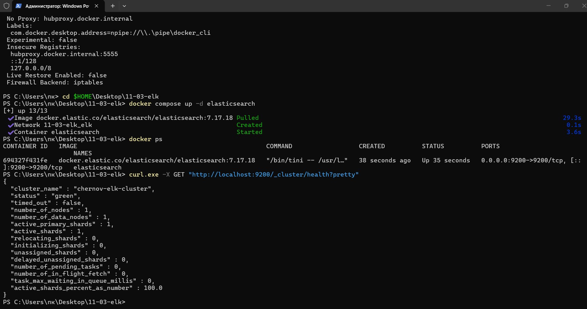
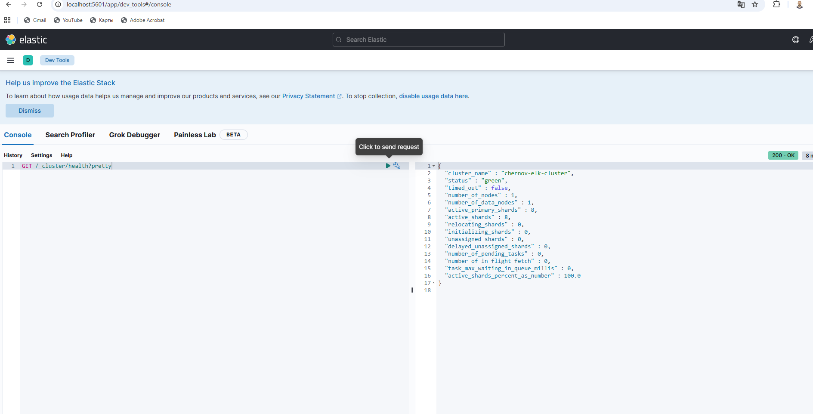
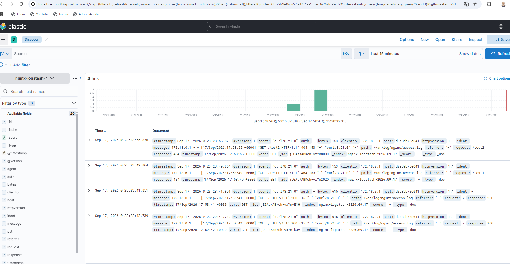
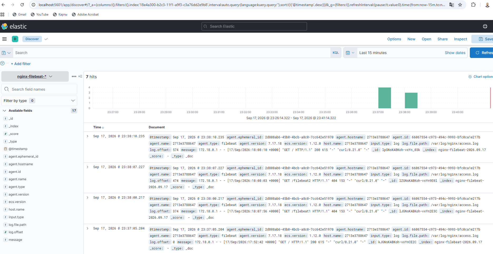

# Домашнее задание к занятию «ELK»


*Выполнил: Павел Чернов*


## Задание 1. Elasticsearch


Для выполнения задания я запустил Elasticsearch в Docker.


Для кластера было задано нестандартное имя:


`chernov-elk-cluster`


После запуска состояние кластера было проверено командой:


```bash

curl.exe -X GET "http://localhost:9200/_cluster/health?pretty"

```


В ответе видно имя кластера и статус `green`.





## Задание 2. Kibana


После Elasticsearch была запущена Kibana.


В разделе Dev Tools был выполнен запрос:


```text

GET /_cluster/health?pretty

```


В ответе также видно имя кластера `chernov-elk-cluster` и его состояние.





## Задание 3. Logstash


Для выполнения задания были запущены Nginx и Logstash.


Nginx создавал access-логи при обращении к веб-серверу.


Для проверки были выполнены запросы:


```bash

curl.exe http://localhost:8080/

curl.exe http://localhost:8080/test1

curl.exe http://localhost:8080/test2

```


Logstash считывал файл `access.log` и отправлял данные в Elasticsearch.


Для логов был создан индекс:


`nginx-logstash-*`


После этого в Kibana Discover появились записи Nginx, включая успешные запросы и запросы с кодом `404`.





## Задание 4. Filebeat


В последнем задании Logstash был остановлен, а сбор логов Nginx был переключён на Filebeat.


Filebeat считывал тот же файл:


`/var/log/nginx/access.log`


и отправлял данные напрямую в Elasticsearch.


Для логов Filebeat был создан отдельный индекс:


`nginx-filebeat-*`


Для проверки были выполнены новые запросы:


```bash

curl.exe http://localhost:8080/filebeat1

curl.exe http://localhost:8080/filebeat2

curl.exe http://localhost:8080/

```


После этого в Kibana Discover появились новые записи уже из индекса Filebeat.




